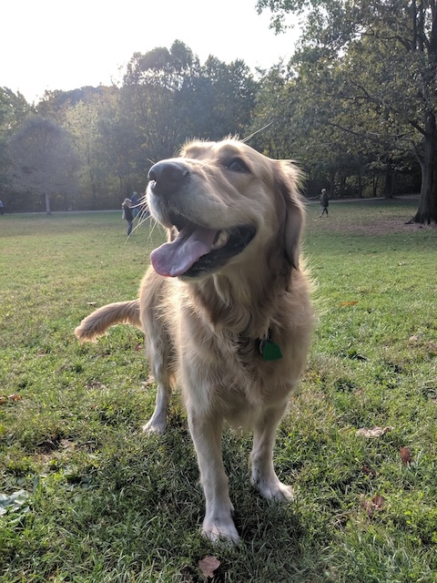

# We Can Learn a Lot From Murphy

> TODO Intro

Inspired by the [Humans of New York post about Pork](https://www.humansofnewyork.com/post/189648036181/it-couldnt-have-turned-out-better-im-just)

## Don't Get Attached to Things

> TODO Edit

Plop! Murphy settles herself down in the middle of a nice patch of grass, stick in her mouth between her front paws at a slight angle and vigorously chomps down on it with her molars at a slight angle. I let her enjoy herself and continue walking ahead down the winding path through Prospect Park. Once I’m about 20 yards ahead, she gets up, stick in mouth, and chases after me, getting a 20 yard headstart on me, where she plops down again, and continues her chewing session, only temporarily interrupted.

Murphy loves chewing on things. Chews. Bones. Sticks. Stuffed animals (well, she really likes ripping those to shreds). It’s sometimes a bit exasperating, because I’ll take her to the park to get exercise and run around, but she simply stops, lies down and chews on a stick.

As much as she loves it, she’s not attached it. She enjoys the chew, as it’s happening. She’ll try to bring it along with her, for the most part. But I can always take it away from her. She won’t growl at me or bite if I reach for what’s ever in her mouth (or reach in her mouth), and she may look at me expectantly for a second after taking the object, but then she moves on to whatever the next grand adventure is.

I think we can learn a lot from Murphy. Buddhists believe that attachments lead to suffering (TODO Find link), and I think Murphy shows me how not being attached to something that brings you so much joy can make life so easy. Enjoy it while you have it. But don’t fight it leaving. It might be for your own good, because it’s time to go for a walk, get outside, or maybe you’ve had too many bones and you’re going to have diarrhea if you keep chomping at them the way you have been.

